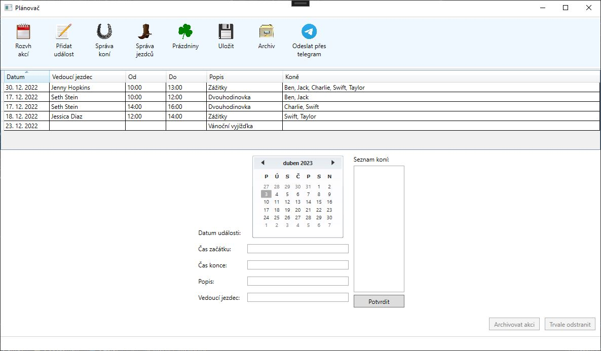

# Plánovač vyjížděk

### Zadání
- práce je realizována s využitím jazyka C# a .NET
- práce nevyužívá externí knihovny (pokud nejsou předem schváleny vyučujícím na základě domluvy)
- aplikace je napsána v souladu s „coding guidelines“ a „naming conventions“ podle jazyka C#
- práce je postavena na jedné z následujících platforem:
  - WPF + MVVM architektura (akceptována je i varianta s Avalonia UI + MVVM)
  - ASP.NET + MVC architektura
  - Android/iOS aplikace s využitím .NET MAUI

### Zvolené téma - zadání
- Jednoduchá databázová aplikace pro specifikované použití (např. kalendář (den, události, poznámky,
upomínky), inventarizační evidence majetku (budovy, místnosti, předměty), organizační aplikace pro pořádání
turnajů (hráči, kola, výsledky), …).
- GUI aplikace s možností zadávat, prohlížet, editovat údaje
- minimálně 3 typy entit (relací) propojené vhodnými relacemi

### Popis aplikace Plánovač Vyjížděk
Aplikace, slouží k jednoduché správě zážitkových vyjížděk na koni. Splňuje požadavek CRUD - tj. všechny entity lze zobrazovat, upravovat, mazat a přidávat. Aplikace je založená na WPF + MVVM architektuře s využitím Community toolkitu pro snadnější práci s MVVM. Pro sdílení dat s průvodci využívá chatbota a NuGet plugin pro posílání zpráv přes Telegram.

Aplikace umožňuje:
- Srozumitelný náhled a plánování událostí
- Postovat inforamce o vyjížďkách přes Telegram
- Schraňovat historii vyjížděk

### IDE
Microsoft Visual Studio Community 2022

### Screenshoty:

